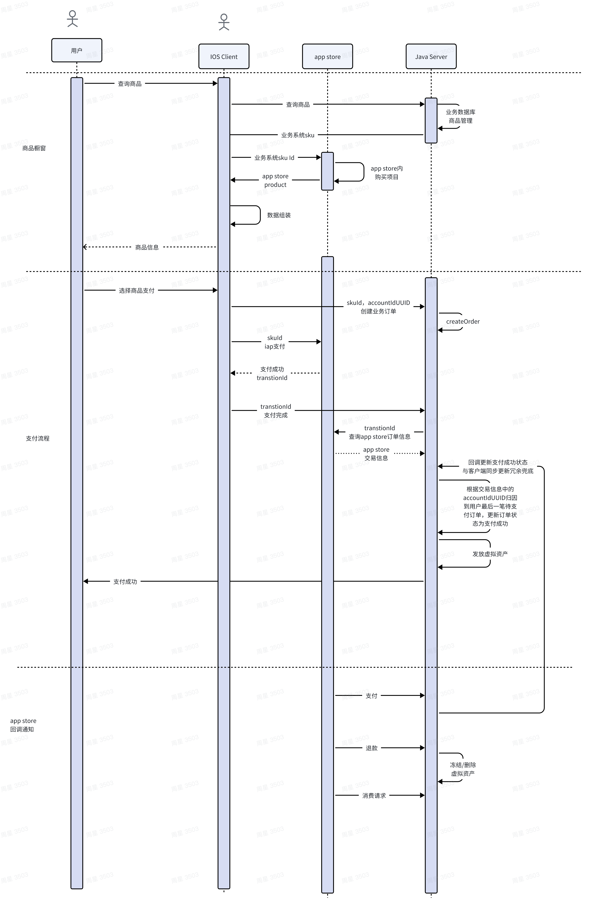

# Apple IAP Java 后端接入指南
## 许可证

**专注于 Apple 应用内购买(IAP) 的 Java 后端接入指南**，基于苹果最新官方文档和 Java SDK 实现的轻量级解决方案。提供完整的应用内购买验证、订阅状态管理和实时通知处理能力，支持 App Store Server API，涵盖一次性商品、自动续期订阅、非续期订阅全场景，帮助开发者快速实现合规、高可用的苹果支付后端接入。
## 功能特性

✅ 支持 App Store Server API (v2)  
✅ 完整覆盖一次性商品（自动续期订阅、非续期订阅商品规划中)  
✅ 购买凭证验证（JWS 解析与验证）   
✅ 实时通知处理  
✅ 支持沙盒环境和生产环境  
✅ 轻量级设计，易于集成

## 快速开始

⚠️ ​**重要提醒**  
在开始集成前，强烈建议开发者先阅读苹果官方文档：  
    [《App Store 应用内购买》官方指南](https://developer.apple.com/cn/documentation/storekit/in-app_purchase/)（包含最新的政策要求、技术规范和设计指南）
    
- 接入流程图(可结合实际业务需求进行调整)
- 
- 
1. ​**信息准备**
    - [企业资质申请](docs/prepare/developer-account.md)
    - [App Store Connect 密钥获取](docs/prepare/appstore-keys.md)
    - [沙箱测试账号配置](docs/prepare/sandbox-accounts.md)
    - [商品创建与定价](docs/prepare/in-app-products.md)

2. ​**SDK 代码接入**
    - [Java 环境配置](docs/integration/environment.md)
    - [依赖引入方式](docs/integration/dependencies.md)
    - [核心 API 初始化](docs/integration/initialization.md)

3. ​**支付流程**
    - [客户端凭证获取](docs/payment/client-side.md)
    - [服务端凭证验证](docs/payment/server-verification.md)
    - [订阅状态同步](docs/payment/subscription-sync.md)

4. ​**测试验证流程**
    - [沙盒环境测试](docs/testing/sandbox-testing.md)
    - [正式环境验证](docs/testing/production-check.md)
    - [常见错误排查](docs/testing/troubleshooting.md)
  

⚠️ ​**暂停更新**  
因为上线后没有任何迭代，所以感觉没什么好写的了，如果有问题大家可以留言提问，看到会第一时间回复
