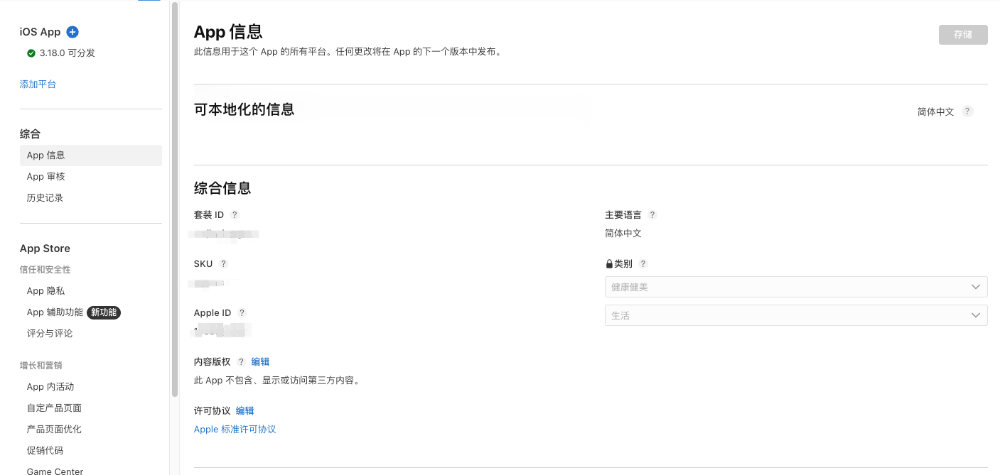

# 企业资质申请

此处不做过多赘述，既然已经开始接入iap支付说明app已经上架app store;

## 申请流程
1. 访问 [Apple Developer app管理页面](https://appstoreconnect.apple.com/apps)
2. 选择要接入的app
3. 选择app信息
    
    这里我们需要获取一些关键信息
   套装 ID
   SKU
   Apple ID

4. 完成企业资质审核（约5-7个工作日）

> ⚠️ 注意：个人开发者账号无法使用自动续期订阅功能